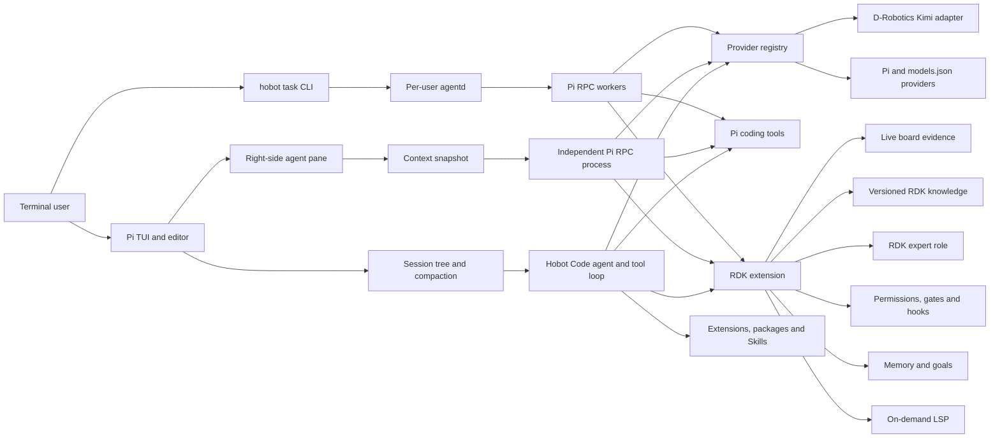

# Hobot Code 架构

Hobot Code 采用“上游交互运行时 + 薄板卡适配层”的结构。Pi 负责终端编辑、会话、Agent 循环和通用工具；Hobot Code 只实现 RDK 所需的 Provider、证据、知识、安全与部署能力。

产品形态是“板端常驻核心 + 双前端”：SSH 现场调试使用 `hobot` TUI，长期任务由每用户的 `agentd` 托管，Mac 上的 Hobot Code 应用是同一控制面的可视化客户端。

## 桌面端与 SSH Bridge

`sdk/go/hobot` 通过系统 OpenSSH 启动 `hobot bridge --stdio`。控制请求复用一条串行化 SSH 连接，每个活跃任务的事件订阅使用独立连接；订阅断开后从最后确认的 sequence 自动退避重连。SSH 参数以独立 argv 传入，不经 Shell 解析；主机、用户、端口、私钥和 host-key 策略均在启动前校验。

`studio/` 是 Wails/Go 桌面应用，对外名称仍为 Hobot Code。它只在 macOS 用户配置目录保存板卡显示名、地址、SSH 用户、端口和可选私钥路径，文件与目录分别限定为 `0600` 和 `0700`，并拒绝符号链接、过大文件和重复 ID。它不保存 SSH 密码、Provider 凭据或工具权限副本。

桌面端按板端工作目录组织项目与任务分支。项目是导航概念，任务的工作目录和会话仍由板端元数据决定；目录浏览、创建和模型枚举由 `agentd` 执行，Mac 端不猜测板端文件系统或 Provider 配置。

桌面端展示 schema-3 normalized events。用户 Prompt 由 `agentd` 作为私有任务事件持久化，前端据此恢复完整用户轮次，并将碎片化的 thinking、工具和回答聚合成对话。板端仍保留原始 Pi RPC 事件用于调试和协议兼容。审批结果通过 task command 发回 `agentd`，最终工具权限和安全边界仍由板端决定，客户端无法绕过。历史消息编辑和侧边任务都是服务端 session 树分支：前者从指定用户消息之前继续，后者从最新已稳定叶节点继续，两者都保留源任务并继承板端权限判定。

## 运行路径



图中主 Agent 与侧边 Agent 指向相同组件，表示两个进程加载相同的 Provider、工具和 RDK 扩展实现，不表示它们共享同一个进程内实例。

## 板端常驻服务

`agentd` 是 Go 编写的按用户常驻控制面，只负责后台任务、事件日志、进程组和客户端重连。每个任务启动发行包内同一个 `runtime/hobot --mode rpc` worker，因此 TUI 与后台模式共享模型、工具、权限、Skills、RDK 知识和系统 Prompt，不存在第二套 Agent 实现。

CLI 通过私有 Unix socket 使用版本化 JSONL 协议。Linux 上除 `0700` 目录和 `0600` socket 外，还校验 `SO_PEERCRED` UID。事件按任务持久化并分配单调序号，客户端可在 SSH 重连后从最后序号继续读取。每个用户默认最多两个后台任务，事件和 stderr 均有硬上限。

daemon 停止、崩溃或板卡重启后，历史和元数据仍可读取，但活动任务只会标记为 `interrupted`。系统不会自动重放 Prompt、审批或工具调用，以免重复产生文件、进程和硬件副作用。用户可显式从已校验的 Pi session 恢复同一对话；新客户端通过 SSH 上的 stdio bridge 消费稳定的 Hobot 事件 schema，不直接依赖 Pi 内部事件。协议细节见 [agentd 协议](agentd-protocol.md)。

`runtime/hobot` 是按版本与 SHA256 固定的 Pi Linux ARM64 standalone 二进制。它读取同目录的产品配置，由 Pi 生成标题、帮助、配置路径、会话 UI 和快捷键。Hobot Code 不复制或修改 Pi 的 TUI 组件、消息队列与会话树实现。

## RDK 适配层

`extensions/rdk/index.ts` 是发行包必须加载的产品扩展入口，负责向 Pi 注册 Provider、工具、命令与生命周期事件，并编排各个独立模块。协议解析、底层安全判定和状态存储核心均由独立模块承担，入口只连接并执行这些策略：

1. **`drobotics-provider.ts`**：编排 Anthropic-compatible 网络请求、超时、SSE 与有界缓冲回退，并生成 Pi 原生 thinking、text、tool call 和 usage 事件。
2. **Provider helpers**：`drobotics-config.mjs`、`drobotics-payload.mjs`、`drobotics-response.mjs`、`anthropic-sse.mjs` 和 `text-safety.mjs` 分别收口超时配置、请求转换、响应验证、有界分帧与 Unicode 修复，避免协议细节混入主编排。
3. **入口中的板卡编排**：从 device tree、`/etc/version`、procfs、sysfs 和 RDK 工具路径取得实机证据，并按 X5 3.x、S100 4.x、S600 5.x 路由版本化知识。
4. **`control-plane.mjs`、`runtime-safety.mjs` 与 `user-paths.mjs`**：实现权限和质量门辅助逻辑、脱敏、工作区指纹、路径解析及高风险 Shell 识别。
5. **`memory-store.ts`、`goal-store.ts`、`hook-runner.ts`、`lsp-manager.ts` 与 `notifications.ts`**：分别管理 SQLite 状态、结构化 Hook 子进程、按需语言服务器和终端通知，入口只负责生命周期衔接。
6. **`side-agent.ts` 及其会话和租约模块**：管理右侧窗格、独立 Pi RPC 子进程、多轮事件和同 UID 并发。
7. **板卡交互层**：渲染紧凑 RDK 专家角色，在 Pi footer 显示本机摘要，并注册 `/rdk`、`/doctor`、`/knowledge`、`/system-prompt`、`/btw` 和退出别名。

扩展继续使用 Pi 的 `read`、`bash`、`edit`、`write`、`grep`、`find` 和 `ls`，不维护同名工具的替代实现。Pi 的其他 Provider、扩展包、Skills、Prompt templates 和 themes 保持可用。

## Provider 数据流

D-Robotics 适配器将 Pi 消息、工具描述和 thinking 预算转换为 Anthropic Messages 请求。文本在序列化前修复不完整的 Unicode 代理项，响应体则受超时与字节上限约束。

正常路径以 `stream: true` 请求，并逐条解析 SSE。只有在网关明确返回非 SSE 内容，或返回已知的不支持流式响应时，才读取有界的完整响应；因此两种路径对 Pi 暴露相同的增量事件语义，而不会无限缓冲响应体。

## 控制面顺序

一次工具调用按以下顺序执行：

```text
权限匹配 -> 交互确认 -> PreToolUse Hook -> 工具执行 -> PostToolUse Hook
```

权限规则按顺序匹配，`deny` 工具会先从活跃工具集合移除，调用阶段仍进行 fail-closed 复核。内置 `write`、`edit` 不允许修改 `/boot`、`/dev`、`/etc`、`/proc`、`/sys`、`/usr` 和 `/var/lib`；它们写入工作区外及 Shell 命中破坏性规则时需要确认。root 默认逐次确认 `bash`、`write`、`edit`；显式切换到 `policy` 后普通操作遵守 allow/ask/deny，但破坏性命令、工作区外写入和关键系统路径仍受硬边界保护。

质量门配置来自项目 `.hobot/quality-gates.json`，会话覆盖与运行结果作为 Pi custom entry 保存。通过结果绑定运行后的工作区指纹；后续写入、编辑、Shell 或 MCP 调用会将结果标记为 `stale`。质量门和修改工具出现在同一并行批次时，门禁调用会被拒绝。

持久目标只能由用户显式创建。模型可以更新进展，但完成目标必须满足当前质量门；预算耗尽只会暂停目标，不会把上下文压缩误判为完成。

LSP 客户端仅在请求匹配语言且命令存在时启动。进程数、单进程 RSS、请求时间和空闲时间都有上限；发行包不捆绑 clangd、pylsp、gopls 等大型语言服务器。

终端通知仅在交互 TUI 中尝试发送，并要求 `stderr` 是 TTY；默认还要求检测到 SSH，除非用户启用本地通知。print、JSON 和 RPC 模式不会写入 OSC 通知序列。

## 侧边 Agent

`/btw` 使用持续存活的独立 Pi RPC 子进程，不占用主 Agent 的事件循环、消息队列或会话树。全屏模式下，主界面与侧边面板被挂载到同一个水平布局树；侧边输出使用 Pi 原生 `ScrollView`，使全屏渲染器可以按指针坐标路由滚轮。一个不消费事件的前置指针监听器只在鼠标主键按下时按横坐标切换输入焦点，随后仍由 Pi 处理文本选择、链接、滚轮和拖动。主 Agent 空闲时，创建过程从 `SessionManager.getBranch()` 物化当前分支；主 Agent 运行时，则从本轮 `before_agent_start` 记录的稳定叶节点物化分支，并以 `agent_settled` 更新该边界。创建时还会校验分支结构，正在运行的 user、未闭合 assistant tool call 或 toolResult 后缀不会进入子进程。子进程还获得父会话当轮的有效系统 Prompt、模型、thinking 等级、工具集合和项目信任状态。

子进程不会重新扫描 Skills。父 Prompt 中已经生效的 Skill 指引会随快照保留，但它不是一套独立的 Skill discovery 流程。每轮输入追加到同一个临时会话，因此侧边对话可以多轮继续；只有 `agent_settled` 才开放下一轮输入。确认、选择和补充输入请求由右侧窗格按请求 ID 排队转交，审批最长等待两分钟。

侧边 Agent 禁止调用持久记忆写入和持久目标变更工具。其消息不写回主会话，关闭后临时会话、Prompt 与运行记录会被删除；但它与主 Agent 共享工作区、OS 用户、进程命名空间、服务和设备视图，已经产生的文件或硬件副作用不会回滚。

每个主会话最多打开一个侧边 Agent。同一 OS 用户的所有 Hobot Code 进程通过 `/tmp` 下的原子租约共同计数，默认上限为 2，可在 1 到 8 之间调整。该计数按 UID 隔离，不是跨用户的整板配额；陈旧租约会在后续获取时清理。

## 数据与隐私

Pi JSONL 会话位于 `~/.local/state/hobot-code/sessions`。Hobot Code 在同一用户状态根目录维护 `memory/memory.db`、`goals/goals.db` 和 Hook 审计；这些数据库不复制主会话消息。`/btw` 为运行需要创建受限权限的临时上下文快照，关闭时删除。

系统 Prompt 保留上游通用编码层，并追加有长度预算的 Hobot Code 身份与英文 RDK 专家层；模型与运行时只作为实现细节，不作为 Agent 的对外身份。回复语言跟随用户。完整硬件详情和知识正文只在模型调用 `system_snapshot`、`rdk_docs_search` 时进入上下文。质量门、召回记忆和活跃目标采用条件注入，没有有效内容时不增加空段落。

记忆写入前执行敏感数据检查，数据库文件和目录默认分别为 `0600` 与 `0700`。自动召回限制条数与作用域。Hook 审计仅保存输入哈希、退出状态和脱敏后的有界输出，不重复保存完整工具输入。

## 部署与回滚

发行包包含按锁文件校验的 Pi、`fd`、`ripgrep` Linux ARM64 二进制，以及从当前提交交叉编译的静态 ARM64 `agentd` 和相应许可证。程序安装在 `/usr/local/lib/hobot-code`，启动器位于 `/usr/local/bin/hobot`，回滚命令位于 `/usr/local/sbin/hobot-rollback`。

公开安装入口从 GitHub Release 读取不可变版本号，下载同版本归档和 SHA256，并在解压前限制归档根目录、规范路径与文件类型。`hobot update` 复用相同入口；`hobot update --extensions` 保留给 Pi 扩展管理。Git tag 发布工作流重新构建发行包，并使用 GitHub OIDC 为归档、安装脚本和版本文件生成 provenance attestation。

安装器必须以 root 运行，并把用户配置与状态写入安装目标用户的 home。通过 `sudo` 调用时目标用户默认取 `SUDO_USER`；直接由 root 调用时默认为 root，也可用 `HOBOT_CODE_INSTALL_USER` 显式指定。升级只补充缺失的默认配置，不覆盖现有用户设置。

升级前，旧命令与运行时会写入 `/usr/local/lib/hobot-code-backups/<UTC timestamp>`。回滚同样需要 root，并且只接受同时包含旧运行时与旧启动命令的完整备份；首次安装没有前一版本时不可回滚。成功恢复的备份会以 `.hobot-restored` 标记并拒绝再次使用，避免同一备份重复切换运行时。回滚不删除当前用户的配置、会话、记忆或目标。

启动器的 `persistent` 子命令把同一个 Hobot Code TUI 置于当前用户的专用 `tmux -L hobot-code` 服务中。终端连接只是可分离的客户端，因此 SSH 断开不触发 Agent 或工具进程退出；重新附着后继续使用同一个进程和屏幕状态。专用服务从只读的随包配置启用鼠标、扩展按键、焦点事件和 256 色终端，不读取或修改普通 `tmux` 服务。会话名经过严格约束并统一添加 `hobot-code-` 前缀。该层不承担板卡重启或进程崩溃恢复。
