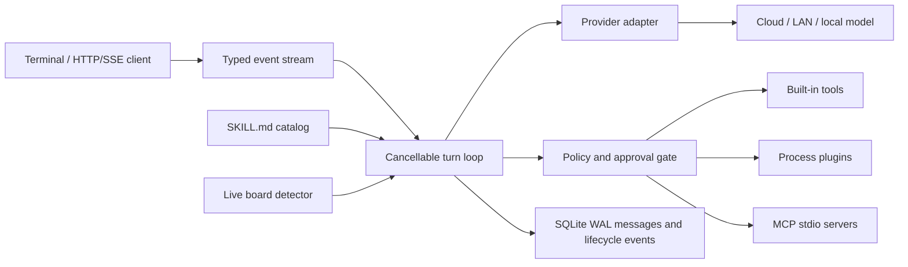

# Aster 架构

## 运行路径

`Agent` 只处理统一的 `Message`、`ToolCall` 和 `ToolDefinition`，厂商协议由
provider adapter 转换。工具执行前依次经过：工具是否注册、参数是否符合 schema、
allow/deny 策略、风险审批、context 超时和输出截断。

每轮请求使用独立 context，并通过有序的 `AgentEvent` 暴露模型文本、模型提供的
reasoning summary、工具生命周期、完成、取消和错误。Anthropic、OpenAI Responses、
OpenAI-compatible 和 Gemini adapter 均解析厂商原生 SSE；若兼容网关返回空事件流，
adapter 会回退到同协议的非流式请求。

## 部署边界

发布产物使用 `GOOS=linux GOARCH=arm64 CGO_ENABLED=0`。X5、S100、S600
共用同一二进制，差异由实时探测和 board overlay 表达，不维护硬件分支。

Aster 可以直接使用云模型，也可以把 OpenAI-compatible provider 指向局域网中的
vLLM/llama.cpp 服务。BPU 上的模型执行不是通用协议：具体模型需要转换、量化、
精度回归和性能测量后，再通过插件或 MCP server 接入。

## 扩展模型

- Built-in tool：和 Aster 同进程，适合低风险、稳定、通用能力。
- Plugin：每次调用启动独立进程，通过一条 JSON-RPC 请求和响应通信。
- MCP：Aster 启动并保持 stdio server，通过 `initialize`、`tools/list`、
  `tools/call` 接入完整工具集合。
- Skill：只包含可审计指令和元数据，可声明所需工具与支持板卡。

## 会话和训练数据

会话目录包含一个 SQLite 数据库，使用 WAL、外键和完整同步写入。消息按
user、assistant、tool 的统一格式保存，工具调用及结果不会被压成普通文本。旧版每会话
一个 JSONL 文件会按行数增量导入，原文件保留以支持回滚。启动时检测到未完成轮次会将
其归档并记录 `session.recovered`，不会把不完整上下文继续发送给模型。

`/undo` 和 `/redo` 只改变当前上下文的可见状态，底层记录及 checkpoint 保留；新分支
产生后，已撤销分支会被归档。`/compact` 使用当前模型生成续聊摘要，将其作为独立的
`context` 消息注入系统 Prompt，并保留压缩前的完整审计轨迹。`aster export SESSION_ID`
同时输出当前消息和所有历史记录，便于审计或转换成训练数据。
