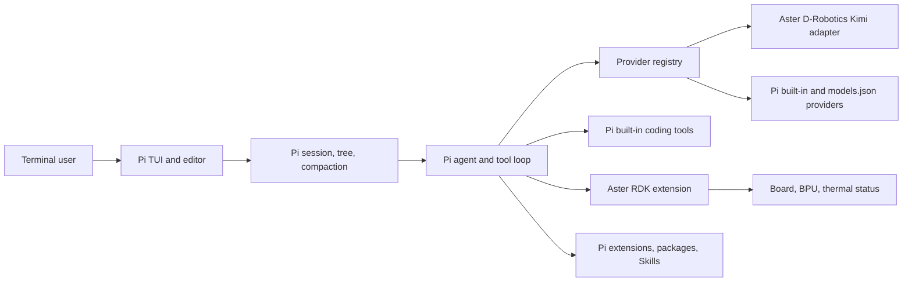

# Aster 0.5 架构

## 运行路径

交互路径没有 Aster 自建 TUI。`runtime/aster` 是固定版本的 Pi 官方 Bun standalone
二进制；它读取同目录的 Aster `package.json`，由 Pi 自己生成标题、帮助、配置路径、
会话 UI 和快捷键。这使交互升级可以跟随明确的 Pi 上游版本，而无需维护两套编辑器。

## 产品适配层

`extensions/rdk.ts` 是唯一必须加载的产品扩展，包含四类适配：

1. D-Robotics Provider：使用 Bearer token 调用 Anthropic-compatible 网关。网关不发送
   完整 SSE 结束事件，因此适配器使用完整响应并生成 Pi 原生 thinking、text、tool call
   和 done 事件。
2. 硬件工具：从 device tree、sysfs、procfs 和 RDK 工具位置读取实时状态。
3. 安全钩子：阻止虚拟设备文件写入，并确认工作区外写入和破坏性 Shell 命令。
4. 板卡 UX：在 Pi 原生 footer status 中显示本机摘要，并增加 `/rdk`、`/doctor` 和退出别名。

扩展不替换 Pi 的 `read`、`bash`、`edit`、`write`、`grep`、`find`、`ls`，也不修改
InteractiveMode、SessionManager、TUI 组件或消息队列。

## 数据和隐私

Pi JSONL 会话存放在 `/var/lib/aster/pi-sessions`。0.4 的 SQLite 数据保持原路径且不自动
转换，避免不完整映射破坏工具轨迹。需要迁移时应显式导出旧会话再导入 Pi。

RDK footer 在本地读取状态。实时板卡详情不会自动写入系统 Prompt；只有用户要求诊断且
模型调用 `system_snapshot` 时，工具结果才进入当前模型上下文。

## 部署与回滚

发行包包含 Pi、fd、ripgrep 的官方 ARM64 二进制及许可证，并锁定版本和 SHA256。
安装目录为 `/usr/local/lib/aster`，短启动器为 `/usr/local/bin/aster`。安装前的命令和
运行时放入 `/usr/local/lib/aster-backups/<UTC timestamp>`，`aster-rollback` 可恢复。
