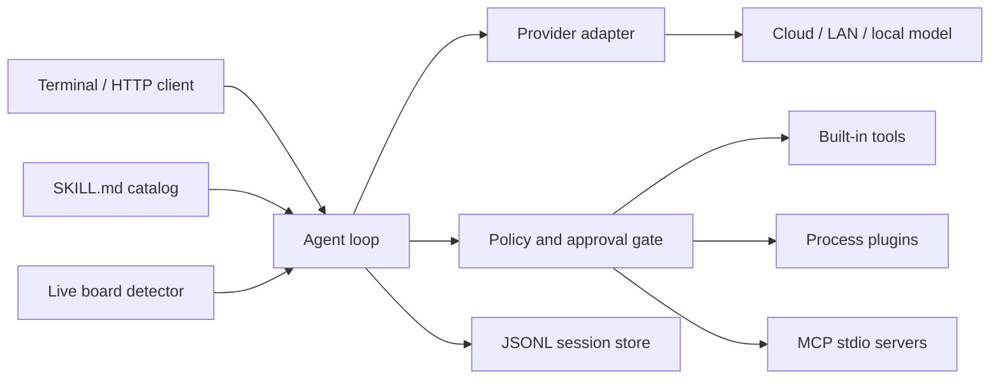

# Aster 架构

## 运行路径

`Agent` 只处理统一的 `Message`、`ToolCall` 和 `ToolDefinition`，厂商协议由
provider adapter 转换。工具执行前依次经过：工具是否注册、参数是否符合 schema、
allow/deny 策略、风险审批、context 超时和输出截断。

## 部署边界

发布产物使用 `GOOS=linux GOARCH=arm64 CGO_ENABLED=0`。X5、S100、S600
共用同一二进制，差异由实时探测和 board overlay 表达，不维护硬件分支。

Aster 可以直接使用云模型，也可以把 OpenAI-compatible provider 指向局域网中的
vLLM/llama.cpp 服务。BPU 上的模型执行不是通用协议：具体模型需要转换、量化、
精度回归和性能测量后，再通过插件或 MCP server 接入。

## 扩展模型

- Built-in tool：和 Aster 同进程，适合低风险、稳定、通用能力。
- Plugin：每次调用启动独立进程，通过一条 JSON-RPC 请求和响应通信。
- MCP：Aster 启动并保持 stdio server，通过 `initialize`、`tools/list`、
  `tools/call` 接入完整工具集合。
- Skill：只包含可审计指令和元数据，可声明所需工具与支持板卡。

## 会话和训练数据

每个会话一个权限为 `0600` 的 JSONL 文件。消息按 user、assistant、tool 的统一格式
保存，工具调用及结果不会被压成普通文本。`aster export SESSION_ID` 输出一条完整轨迹，
便于审计或转换成 assistant-only-loss 的 SFT 数据。
