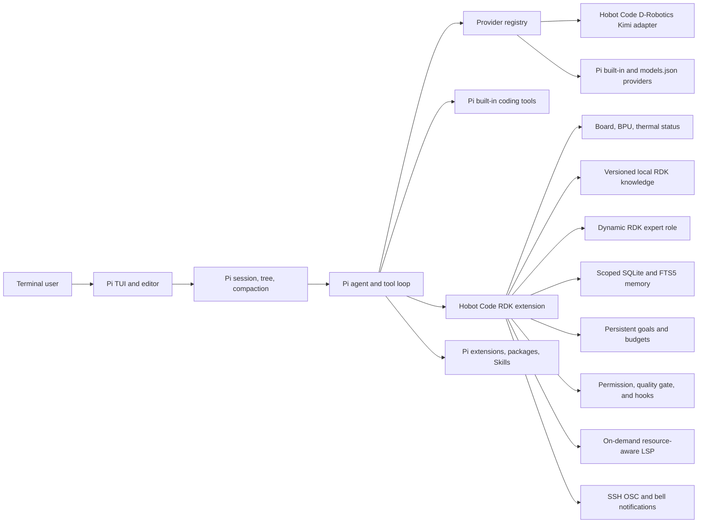

# Hobot Code 0.11.1 架构

## 运行路径

交互路径没有 Hobot Code 自建 TUI。`runtime/hobot` 是固定版本的 Pi 官方 Bun standalone
二进制；它读取同目录的 Hobot Code `package.json`，由 Pi 自己生成标题、帮助、配置路径、
会话 UI 和快捷键。这使交互升级可以跟随明确的 Pi 上游版本，而无需维护两套编辑器。

## 产品适配层

`extensions/rdk/index.ts` 是唯一必须加载的产品扩展，包含以下适配：

1. D-Robotics Provider：使用 Bearer token 调用 Anthropic-compatible 网关。网关不发送
   完整 SSE 结束事件，因此适配器使用完整响应并生成 Pi 原生 thinking、text、tool call
   和 done 事件。
2. 硬件工具：从 device tree、`/etc/version`、sysfs、procfs 和 RDK 工具位置读取实时状态。
3. 专家角色：把稳定实机标识渲染进紧凑 RDK 覆盖层，只规定 Pi 不具备的证据、版本、BPU
   验收和硬件安全边界。
4. 知识路由：按 X5 3.x、S100 4.x、S600 5.x 检索本地知识包，返回版本匹配状态和官方来源。
5. 安全钩子：阻止虚拟设备文件写入，并确认工作区外写入和破坏性 Shell 命令。
6. 板卡 UX：在 Pi 原生 footer status 中显示本机摘要，并增加 `/rdk`、`/doctor`、
   `/knowledge`、`/system-prompt` 和退出别名。
7. 持久化记忆：使用 Bun 内置 SQLite/FTS5 按 user、project、board、session 隔离，
   支持过期、去重、检索、召回、审计和用户删除。
8. 持久目标：用户显式创建项目目标，记录 turn/token 预算、耗时、继续次数、进度和验证指纹，
   跨会话恢复且不把上下文压缩当作完成。
9. 工具 Hook：在工具调用前后运行结构化 argv 命令，提供超时、输出上限、block/warn 策略和
   脱敏审计；项目 Hook 必须由全局配置显式放行。
10. SSH 通知：在批准等待、长任务完成、失败或目标预算耗尽时发出可关闭的 OSC/bell 通知。
11. 资源感知 LSP：按文件扩展名和已安装服务按需启动，限制进程数、RSS、请求时间和空闲时间。

扩展不替换 Pi 的 `read`、`bash`、`edit`、`write`、`grep`、`find`、`ls`，也不修改
InteractiveMode、SessionManager、TUI 组件或消息队列。

## 数据和隐私

Pi JSONL 会话存放在 `~/.local/state/hobot-code/sessions`。终端展示与执行状态仍由 Pi 会话模型统一
管理。Hobot Code 另外在同一用户状态根目录维护 `memory/memory.db` 和 `goals/goals.db`，
不复制会话消息。

RDK footer 在本地读取状态。系统 Prompt 保留 Pi 的通用编码层，并追加不超过 1700 字符、同为
英文的 RDK 紧凑层；它要求回答跟随用户语言。完整硬件详情与知识正文分别只在模型调用
`system_snapshot`、`rdk_docs_search` 时进入上下文。
`/system-prompt` 默认只报告各层字符数和状态，避免把全文刷满终端；显式执行
`/system-prompt full` 才展开最近一轮的完整内容。
记忆在写入前执行敏感数据检查，数据库和目录分别为 `0600` 和 `0700`。自动召回有条数上限，
只将当前作用域内的相关条目加入模型上下文。质量门、召回记忆和持久目标采用条件状态层：仅在
实际配置、命中或激活时加入短段落，空状态不进入 Prompt。Hook 审计写入
`~/.local/state/hobot-code/audit/hooks.jsonl`，保存输入哈希、退出状态和脱敏后的有界输出，不重复保存
完整工具输入。

## 控制面

`extensions/rdk/control-plane.mjs` 提供无第三方依赖、可单测的权限、初始化、脱敏和
工作区指纹逻辑，`extensions/rdk/index.ts` 只负责接入 Pi 生命周期。会话启动时 deny 工具从 active
tools 中移除，`tool_call` 再执行 fail-closed 检查；ask 工具必须在交互 TUI 中确认。

质量门配置来自项目 `.hobot/quality-gates.json`，会话覆盖与结果通过 Pi custom entry 保存，
不引入第二套数据库。结果只对运行后取得的工作区指纹有效；后续写入、编辑、Shell 或 MCP
调用会保守地将结果标记为 stale。质量门与修改工具出现在同一并行批次时，门禁调用会被拒绝。
工具执行顺序为权限判定、交互批准、PreToolUse Hook、实际工具、PostToolUse Hook。持久目标只有
用户显式创建；模型完成目标时必须满足当前质量门，预算耗尽则自动暂停。

LSP 客户端不常驻预热：第一次查询匹配语言时才启动，超出进程数会回收最久未使用实例，超过
RSS 或空闲上限会自动停止。默认发行包只提供协议客户端和配置，不捆绑各语言服务器。

## 部署与回滚

发行包包含 Pi、fd、ripgrep 的官方 ARM64 二进制及许可证，并锁定版本和 SHA256。
安装目录为 `/usr/local/lib/hobot-code`，启动器为 `/usr/local/bin/hobot`。安装前的命令和
运行时放入 `/usr/local/lib/hobot-code-backups/<UTC timestamp>`，`hobot-rollback` 可恢复。升级保留
现有配置、会话、记忆和目标数据库；新的 P1 配置文件仅在缺失时安装。
